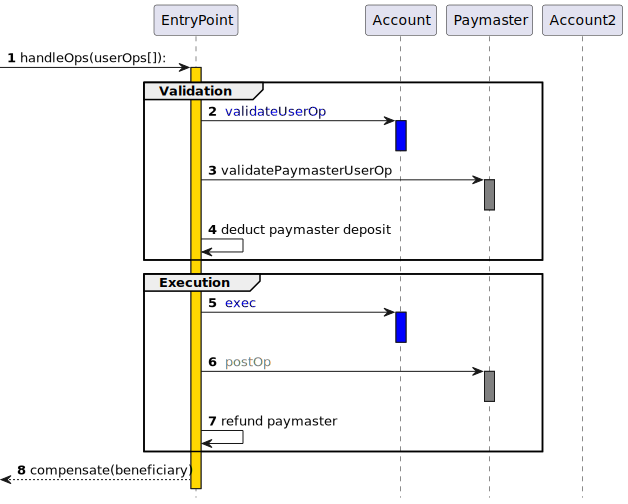

## Abstract

An account abstraction proposal which completely avoids the need for consensus-layer protocol changes. Instead of adding new protocol features and changing the bottom-layer transaction type, this proposal instead introduces a higher-layer pseudo-transaction object called a `UserOperation`. Users send `UserOperation` objects into a separate mempool. A special class of actor called bundlers package up a set of these objects into a transaction making a `handleOps` call to a special contract, and that transaction then gets included in a block.

## Motivation

See also `https://ethereum-magicians.org/t/implementing-account-abstraction-as-part-of-eth1-x/4020` and the links therein for historical work and motivation, and [EIP-2938](./eip-2938.md) for a consensus layer proposal for implementing the same goal.

This proposal takes a different approach, avoiding any adjustments to the consensus layer. It seeks to achieve the following goals:

* **Achieve the key goal of account abstraction**: allow users to use smart contract wallets containing arbitrary verification logic instead of EOAs as their primary account. Completely remove any need at all for users to also have EOAs (as status quo SC wallets and [EIP-3074](./eip-3074.md) both require)
* **Decentralization**
    * Allow any bundler (think: block builder) to participate in the process of including account-abstracted user operations
    * Work with all activity happening over a public mempool; users do not need to know the direct communication addresses (eg. IP, onion) of any specific actors
    * Avoid trust assumptions on bundlers
* **Do not require any Ethereum consensus changes**: Ethereum consensus layer development is focusing on the merge and later on scalability-oriented features, and there may not be any opportunity for further protocol changes for a long time. Hence, to increase the chance of faster adoption, this proposal avoids Ethereum consensus changes.
* **Try to support other use cases**
    * Privacy-preserving applications
    * Atomic multi-operations (similar goal to [EIP-3074](./eip-3074.md))
    * Pay tx fees with [ERC-20](./eip-20.md) tokens, allow developers to pay fees for their users, and [EIP-3074](./eip-3074.md)-like **sponsored transaction** use cases more generally
    * Support aggregated signature (e.g. BLS)

## Specification

### Definitions

* **UserOperation** - a structure that describes a transaction to be sent on behalf of a user. To avoid confusion, it is not named "transaction".
  * Like a transaction, it contains "sender", "to", "calldata", "maxFeePerGas", "maxPriorityFee", "signature", "nonce"
  * unlike a transaction, it contains several other fields, described below
  * also, the "signature" field usage is not defined by the protocol, but by each account implementation
* **Sender** - the account contract sending a user operation.
* **EntryPoint** - a singleton contract to execute bundles of UserOperations. Bundlers/Clients whitelist the supported entrypoint.
* **Bundler** - a node (block builder) that can handle UserOperations,
  create a valid an EntryPoint.handleOps() transaction,
  and add it to the block while it is still valid.
  This can be achieved by a number of ways:
  * Bundler can act as a block builder itself
  * If the bundler is not a block builder, it MUST work with the block building infrastructure such as `mev-boost` or
    other kind of PBS (proposer-builder separation)
  * The `bundler` can also rely on an experimental `eth_sendRawTransactionConditional` RPC API if it is available.
* **Aggregator** - a helper contract trusted by accounts to validate an aggregated signature. Bundlers/Clients whitelist the supported aggregators.

To avoid Ethereum consensus changes, we do not attempt to create new transaction types for account-abstracted transactions. Instead, users package up the action they want their account to take in an ABI-encoded struct called a `UserOperation`:

| Field | Type | Description
| - | - | - |
| `sender` | `address` | The account making the operation |
| `nonce` | `uint256` | Anti-replay parameter (see "Semi-abstracted Nonce Support" ) |
| `initCode` | `bytes` | The initCode of the account (needed if and only if the account is not yet on-chain and needs to be created) |
| `callData` | `bytes` | The data to pass to the `sender` during the main execution call |
| `callGasLimit` | `uint256` | The amount of gas to allocate the main execution call |
| `verificationGasLimit` | `uint256` | The amount of gas to allocate for the verification step |
| `preVerificationGas` | `uint256` | The amount of gas to pay for to compensate the bundler for pre-verification execution, calldata and any gas overhead that can't be tracked on-chain |
| `maxFeePerGas` | `uint256` | Maximum fee per gas (similar to [EIP-1559](./eip-1559.md) `max_fee_per_gas`) |
| `maxPriorityFeePerGas` | `uint256` | Maximum priority fee per gas (similar to EIP-1559 `max_priority_fee_per_gas`) |
| `paymasterAndData` | `bytes` | Address of paymaster sponsoring the transaction, followed by extra data to send to the paymaster (empty for self-sponsored transaction) |
| `signature` | `bytes` | Data passed into the account along with the nonce during the verification step |

Users send `UserOperation` objects to a dedicated user operation mempool. A specialized class of actors called **bundlers** (either block builders running special-purpose code, or users that can relay transactions to block builders eg. through a bundle marketplace such as Flashbots that can guarantee next-block-or-never inclusion) listen in on the user operation mempool, and create **bundle transactions**. A bundle transaction packages up multiple `UserOperation` objects into a single `handleOps` call to a pre-published global **entry point contract**.

To prevent replay attacks (both cross-chain and multiple `EntryPoint` implementations), the `signature` should depend on `chainid` and the `EntryPoint` address.

The core interface of the entry point contract is as follows:

```solidity
function handleOps(UserOperation[] calldata ops, address payable beneficiary);

function handleAggregatedOps(
    UserOpsPerAggregator[] calldata opsPerAggregator,
    address payable beneficiary
);

struct UserOpsPerAggregator {
    UserOperation[] userOps;
    IAggregator aggregator;
    bytes signature;
}
```

The core interface required for an account to have is:

```solidity
interface IAccount {
  function validateUserOp
      (UserOperation calldata userOp, bytes32 userOpHash, uint256 missingAccountFunds)
      external returns (uint256 validationData);
}
```

The `userOpHash` is a hash over the userOp (except signature), entryPoint and chainId.  

The account:

* MUST validate the caller is a trusted EntryPoint
* If the account does not support signature aggregation, it MUST validate the signature is a valid signature of the `userOpHash`, and
  SHOULD return SIG_VALIDATION_FAILED (and not revert) on signature mismatch. Any other error MUST revert.
* MUST pay the entryPoint (caller) at least the "missingAccountFunds" (which might be zero, in case current account's deposit is high enough)
* The account MAY pay more than this minimum, to cover future transactions (it can always issue `withdrawTo` to retrieve it)
* The return value MUST be packed of `authorizer`, `validUntil` and `validAfter` timestamps.
  * authorizer - 0 for valid signature, 1 to mark signature failure. Otherwise, an address of an authorizer contract. This ERC defines "signature aggregator" as authorizer.
  * `validUntil` is 6-byte timestamp value, or zero for "infinite". The UserOp is valid only up to this time.
  * `validAfter` is 6-byte timestamp. The UserOp is valid only after this time.
  
An account that works with aggregated signature, should return its signature aggregator address in the "sigAuthorizer" return value of validateUserOp.
It MAY ignore the signature field

The core interface required by an aggregator is:

```solidity
interface IAggregator {

  function validateUserOpSignature(UserOperation calldata userOp)
  external view returns (bytes memory sigForUserOp);

  function aggregateSignatures(UserOperation[] calldata userOps) external view returns (bytes memory aggregatesSignature);

  function validateSignatures(UserOperation[] calldata userOps, bytes calldata signature) view external;
}
```

* If an account uses an aggregator (returns it from validateUserOp), then its address is returned by `simulateValidation()` reverting with `ValidationResultWithAggregator` instead of `ValidationResult`
* To accept the UserOp, the bundler must call **validateUserOpSignature()** to validate the userOp's signature.
* **aggregateSignatures()** must aggregate all UserOp signature into a single value.  
* Note that the above methods are helper method for the bundler. The bundler MAY use a native library to perform the same validation and aggregation logic.
* **validateSignatures()** MUST validate the aggregated signature matches for all UserOperations in the array, and revert otherwise.
  This method is called on-chain by `handleOps()`

#### Semi-abstracted Nonce Support

In Ethereum protocol, the sequential transaction `nonce` value is used as a replay protection method as well as to
determine the valid order of transaction being included in blocks.

It also contributes to the transaction hash uniqueness, as a transaction by the same sender with the same
nonce may not be included in the chain twice.

However, requiring a single sequential `nonce` value is limiting the senders' ability to define their custom logic
with regard to transaction ordering and replay protection.

Instead of sequential `nonce` we implement a nonce mechanism that uses a single `uint256` nonce value in the `UserOperation`,
but treats it as two values:

* 192-bit "key"
* 64-bit "sequence"

These values are represented on-chain in the `EntryPoint` contract.
We define the following method in the `EntryPoint` interface to expose these values:

```solidity
function getNonce(address sender, uint192 key) external view returns (uint256 nonce);
```

For each `key` the `sequence` is validated and incremented sequentially and monotonically by the `EntryPoint` for
each UserOperation, however a new key can be introduced with an arbitrary value at any point.

This approach maintains the guarantee of `UserOperation` hash uniqueness on-chain on the protocol level while allowing
wallets to implement any custom logic they may need operating on a 192-bit "key" field, while fitting the 32 byte word.

##### Reading and validating the nonce

When preparing the UserOp clients may make a view call to this method to determine a valid value for the `nonce` field.

Bundler's validation of a UserOp should start with `getNonce` to ensure the transaction has a valid `nonce` field.

If the bundler is willing to accept multiple UserOperations by the same sender into their mempool,
this bundler is supposed to track the `key` and `sequence` pair of the UserOperations already added in the mempool.

##### Usage examples

1. Classic sequential nonce.

   In order to require the wallet to have classic, sequential nonce, the validation function should perform:

   ```solidity
   require(userOp.nonce<type(uint64).max)
   ```

2. Ordered administrative events

   In some cases, an account may need to have an "administrative" channel of operations running in parallel to normal
   operations.

   In this case, the account may use specific `key` when calling methods on the account itself:

   ```solidity
   bytes4 sig = bytes4(userOp.callData[0 : 4]);
   uint key = userOp.nonce >> 64;
   if (sig == ADMIN_METHODSIG) {
       require(key == ADMIN_KEY, "wrong nonce-key for admin operation");
   } else {
       require(key == 0, "wrong nonce-key for normal operation");
   }
   ```

#### Using signature aggregators

An account signifies it uses signature aggregation returning its address from `validateUserOp`.
During `simulateValidation`, this aggregator is returned (in the `ValidationResultWithAggregator`)

The bundler should first accept the aggregator (validate its stake info and that it is not throttled/banned)
Then it MUST verify the userOp using `aggregator.validateUserOpSignature()`

Signature aggregator SHOULD stake just like a paymaster, unless it is exempt due to not accessing global storage - see [reputation, throttling and banning section](#reputation-scoring-and-throttlingbanning-for-global-entities) for details. Bundlers MAY throttle down and ban aggregators in case they take too much
resources (or revert) when the above methods are called in view mode, or if the signature aggregation fails.

### Required entry point contract functionality

There are 2 separate entry point methods: `handleOps` and `handleAggregatedOps`

* `handleOps` handle userOps of accounts that don't require any signature aggregator.
* `handleAggregatedOps` can handle a batch that contains userOps of multiple aggregators (and also requests without any aggregator)
* `handleAggregatedOps` performs the same logic below as `handleOps`, but it must transfer the correct aggregator to each userOp, and also must call `validateSignatures` on each aggregator after doing all the per-account validation.
The entry point's `handleOps` function must perform the following steps (we first describe the simpler non-paymaster case). It must make two loops, the **verification loop** and the **execution loop**. In the verification loop, the `handleOps` call must perform the following steps for each `UserOperation`:

* **Create the account if it does not yet exist**, using the initcode provided in the `UserOperation`. If the account does not exist, _and_ the initcode is empty, or does not deploy a contract at the "sender" address, the call must fail.
* calculate the maximum possible fee the account needs to pay (based on validation and call gas limits, and current gas values)
* calculate the fee the account must add to its "deposit" in the EntryPoint
* **Call `validateUserOp` on the account**, passing in the `UserOperation`, its hash and the required fee. The account should verify the operation's signature, and pay the fee if the account considers the operation valid. If any `validateUserOp` call fails, `handleOps` must skip execution of at least that operation, and may revert entirely.
* Validate the account's deposit in the entryPoint is high enough to cover the max possible cost (cover the already-done verification and max execution gas)

In the execution loop, the `handleOps` call must perform the following steps for each `UserOperation`:

* **Call the account with the `UserOperation`'s calldata**. It's up to the account to choose how to parse the calldata; an expected workflow is for the account to have an `execute` function that parses the remaining calldata as a series of one or more calls that the account should make.
* After the call, refund the account's deposit with the excess gas cost that was pre-charged.\
 A penalty of `10%` (`UNUSED_GAS_PENALTY_PERCENT`) is applied on the amount of gas that is refunded.\
 This penalty is necessary to prevent the UserOps from reserving large parts of the gas space in the bundle but leaving it unused and preventing the bundler from including other UserOperations.
* After the execution of all calls, pay the collected fees from all UserOperations to the bundler's provided address


Before accepting a `UserOperation`, bundlers should use an RPC method to locally call the `simulateValidation` function on the entry point, to verify that the signature is correct and the operation actually pays fees; see the [Simulation section below](#simulation) for details.
A node/bundler SHOULD drop (not add to the mempool) a `UserOperation` that fails the validation

### Extension: paymasters

We extend the entry point logic to support **paymasters** that can sponsor transactions for other users. This feature can be used to allow application developers to subsidize fees for their users, allow users to pay fees with [ERC-20](./eip-20.md) tokens and many other use cases. When the paymasterAndData field in the UserOp is not empty, the entry point implements a different flow for that UserOperation:



During the verification loop, in addition to calling `validateUserOp`, the `handleOps` execution also must check that the paymaster has enough ETH deposited with the entry point to pay for the operation, and then call `validatePaymasterUserOp` on the paymaster to verify that the paymaster is willing to pay for the operation. Note that in this case, the `validateUserOp` is called with a `missingAccountFunds` of 0 to reflect that the account's deposit is not used for payment for this userOp.

If the paymaster's validatePaymasterUserOp returns a "context", then `handleOps` must call `postOp` on the paymaster after making the main execution call. It must guarantee the execution of `postOp`, by making the main execution inside an inner call context, and if the inner call context reverts attempting to call `postOp` again in an outer call context.

Maliciously crafted paymasters _can_ DoS the system. To prevent this, we use a reputation system. paymaster must either limit its storage usage, or have a stake. see the [reputation, throttling and banning section](#reputation-scoring-and-throttlingbanning-for-global-entities) for details.

The paymaster interface is as follows:

```c++
  function validatePaymasterUserOp
    (UserOperation calldata userOp, bytes32 userOpHash, uint256 maxCost)
    external returns (bytes memory context, uint256 validationData);

function postOp
    (PostOpMode mode, bytes calldata context, uint256 actualGasCost)
    external;

enum PostOpMode {
    opSucceeded, // user op succeeded
    opReverted, // user op reverted. still has to pay for gas.
    postOpReverted // user op succeeded, but caused postOp to revert
}
```


```c++
// add a paymaster stake (must be called by the paymaster)
function addStake(uint32 _unstakeDelaySec) external payable

// unlock the stake (must wait unstakeDelay before can withdraw)
function unlockStake() external

// withdraw the unlocked stake
function withdrawStake(address payable withdrawAddress) external
```

The paymaster must also have a deposit, which the entry point will charge UserOperation costs from.
The deposit (for paying gas fees) is separate from the stake (which is locked).

The entry point must implement the following interface to allow paymasters (and optionally accounts) manage their deposit:

```c++
// return the deposit of an account
function balanceOf(address account) public view returns (uint256)

// add to the deposit of the given account
function depositTo(address account) public payable

// withdraw from the deposit of the current account
function withdrawTo(address payable withdrawAddress, uint256 withdrawAmount) external
```

### Client behavior upon receiving a UserOperation

When a client receives a `UserOperation`, it must first run some basic sanity checks, namely that:

* Either the `sender` is an existing contract, or the `initCode` is not empty (but not both)
* If `initCode` is not empty, parse its first 20 bytes as a factory address.  Record whether the factory is staked, in case the later simulation indicates that it needs to be.  If the factory accesses global state, it must be staked - see [reputation, throttling and banning section](#reputation-scoring-and-throttlingbanning-for-global-entities) for details.
* The `verificationGasLimit` is sufficiently low (`<= MAX_VERIFICATION_GAS`) and the `preVerificationGas` is sufficiently high (enough to pay for the calldata gas cost of serializing the `UserOperation` plus `PRE_VERIFICATION_OVERHEAD_GAS`)
* The `paymasterAndData` is either empty, or start with the **paymaster** address, which is a contract that (i) currently has nonempty code on chain, (ii) has a sufficient deposit to pay for the UserOperation, and (iii) is not currently banned. During simulation, the paymaster's stake is also checked, depending on its storage usage - see [reputation, throttling and banning section](#reputation-scoring-and-throttlingbanning-for-global-entities) for details.
* The callgas is at least the cost of a `CALL` with non-zero value.
* The `maxFeePerGas` and `maxPriorityFeePerGas` are above a configurable minimum value that the client is willing to accept. At the minimum, they are sufficiently high to be included with the current `block.basefee`.
* The sender doesn't have another `UserOperation` already present in the pool (or it replaces an existing entry with the same sender and nonce, with a higher `maxPriorityFeePerGas` and an equally increased `maxFeePerGas`). Only one `UserOperation` per sender may be included in a single batch. A sender is exempt from this rule and may have multiple `UserOperations` in the pool and in a batch if it is staked (see [reputation, throttling and banning section](#reputation-scoring-and-throttlingbanning-for-global-entities) below), but this exception is of limited use to normal accounts.

If the `UserOperation` object passes these sanity checks, the client must next run the first op simulation, and if the simulation succeeds, the client must add the op to the pool. A second simulation must also happen during bundling to make sure the UserOperation is still valid.

### Simulation

#### Simulation Rationale

In order to add a UserOperation into the mempool (and later to add it into a bundle) we need to "simulate" its validation to make sure it is valid, and that it is capable of paying for its own execution.
In addition, we need to verify that the same will hold true when executed on-chain.
For this purpose, a UserOperation is not allowed to access any information that might change between simulation and execution, such as current block time, number, hash etc.
In addition, a UserOperation is only allowed to access data related to this sender address: Multiple UserOperations should not access the same storage, so that it is impossible to invalidate a large number of UserOperations with a single state change.
There are 3 special contracts that interact with the account: the factory (initCode) that deploys the contract, the paymaster that can pay for the gas, and signature aggregator (described later)
Each of these contracts is also restricted in its storage access, to make sure UserOperation validations are isolated.

#### Specification:

To simulate a `UserOperation` validation, the client makes a view call to `simulateValidation(userop)`.

The EntryPoint itself does not implement the simulation methods. Instead, when making the simulation view call, 
The bundler should provide the alternate EntryPointSimulations code, which extends the EntryPoint with the simulation methods.

The simulation core methods:

```solidity

struct ValidationResult {
    ReturnInfo returnInfo;
    StakeInfo senderInfo;
    StakeInfo factoryInfo;
    StakeInfo paymasterInfo;
    AggregatorStakeInfo aggregatorInfo;
}

function simulateValidation(UserOperation calldata userOp) 
external returns (ValidationResult memory);

struct ReturnInfo {
    uint256 preOpGas;
    uint256 prefund;
    bool sigFailed;
    uint48 validAfter;
    uint48 validUntil;
    bytes paymasterContext;
}

struct AggregatorStakeInfo {
    address aggregator;
    StakeInfo stakeInfo;
}

struct StakeInfo {
  uint256 stake;
  uint256 unstakeDelaySec;
}


```

This method returns `ValidationResult` or revert on validation failure.
The node should drop the UserOperation if the simulation fails (either by revert or by "signature failure")

The simulated call performs the full validation, by calling:

1. If `initCode` is present, create the account.
2. `account.validateUserOp`.
3. if specified a paymaster: `paymaster.validatePaymasterUserOp`.

Either `validateUserOp` or `validatePaymasterUserOp` may return a "validAfter" and "validUntil" timestamps, which is the time-range that this UserOperation is valid on-chain.
The simulateValidation call returns this range.
A node MAY drop a UserOperation if it expires too soon (e.g. wouldn't make it to the next block)
If the `ValidationResult` includes `sigFail`, the client SHOULD drop the `UserOperation`.

In order to prevent DoS attack on bundlers, they must make sure the validation methods above pass the validation rules, which constraint their usage of opcodes and storage.
For the complete procedure see [eip-aa-validation-rules](./eip-aa-rules.md)

#### Alternative Mempools

The simulation rules above are strict and prevent the ability of paymasters and signature aggregators to grief the system.
However, there might be use-cases where specific paymasters (and signature aggregators) can be validated
(through manual auditing) and verified that they cannot cause any problem, while still require relaxing of the opcode rules.
A bundler cannot simply "whitelist" request from a specific paymaster: if that paymaster is not accepted by all
bundlers, then its support will be sporadic at best.
Instead, we introduce the term "alternate mempool": a modified validation rules, and procedure of propagating them to other bundlers. 

The procedure of using alternate mempools is defined in ../eip-aa-rules.md#Alt-mempools-rules

### Bundling

During bundling, the client should:

* Exclude UserOps that access any sender address of another UserOp in the same batch.
* Exclude UserOps that access any address created by another UserOp validation in the same batch (via a factory).
* For each paymaster used in the batch, keep track of the balance while adding UserOps. Ensure that it has sufficient deposit to pay for all the UserOps that use it.
* Sort UserOps by aggregator, to create the lists of UserOps-per-aggregator.
* For each aggregator, run the aggregator-specific code to create aggregated signature, and update the UserOps

After creating the batch, before including the transaction in a block, the client should:

* Run `debug_traceCall` with maximum possible gas, to enforce the validation rules on opcode and storage access.
  as well as to verify the entire `handleOps` batch transaction,
  and use the consumed gas for the actual transaction execution.
* If the call reverted, check the `FailedOp` event.
  A `FailedOp` during `handleOps` simulation is an unexpected event since it was supposed to be caught
  by the single-UserOperation simulation.
* If any verification context rule was violated the bundlers should treat it the same as
  if this UserOperation reverted with a `FailedOp` event.
* Remove the offending UserOperation from the current bundle and from mempool.
* If the error is caused by a `factory` (error code is `AA1x`) or a `paymaster` (error code is `AA3x`), and the `sender`
  of the UserOp **is not** a staked entity, then issue a "ban" (see ["Reputation, throttling and banning"](#reputation-scoring-and-throttlingbanning-for-global-entities))
  for the guilty factory or paymaster.
* If the error is caused by a `factory` (error code is `AA1x`) or a `paymaster` (error code is `AA3x`), and the `sender`
  of the UserOp **is** a staked entity, do not ban the `factory` / `paymaster` from the mempool.
  Instead, issue a "ban" for the staked `sender` entity.
* Repeat until `debug_traceCall` succeeds.

As staked entries may use some kind of transient storage to communicate data between UserOperations in the same bundle,
it is critical that the exact same opcode and precompile banning rules as well as storage access rules are enforced
for the `handleOps` validation in its entirety as for individual UserOperations.
Otherwise, attackers may be able to use the banned opcodes to detect running on-chain and trigger a `FailedOp` revert.

When a bundler includes a bundle in a block it must ensure that earlier transactions in the block don't make any UserOperation fail. It should either use access lists to prevent conflicts, or place the bundle as the first transaction in the block.

### Reputation scoring and throttling/banning for global entities

#### Reputation Rationale.

UserOperation's storage access rules prevent them from interfere with each other.
But "global" entities - paymasters, factories and aggregators are accessed by multiple UserOperations, and thus might invalidate multiple previously-valid UserOperations.

To prevent abuse, we throttle down (or completely ban for a period of time) an entity that causes invalidation of large number of UserOperations in the mempool.
To prevent such entities from "sybil-attack", we require them to stake with the system, and thus make such DoS attack very expensive.
Note that this stake is never slashed, and can be withdrawn any time (after unstake delay)

Unstaked entities are allowed, under the rules below.

When staked, an entity is less restricted in its memory usage. 

The stake value is not enforced on-chain, but specifically by each node while simulating a transaction.

### Paymasters

Paymasters facilitate transaction sponsorship, allowing third-party-designed mechanisms to pay for transactions. Many of these mechanisms _could_ be done by having the paymaster wrap a `UserOperation` with their own, but there are some important fundamental limitations to that approach:

* No possibility for "passive" paymasters (eg. that accept fees in some ERC-20 token at an exchange rate pulled from an on-chain DEX)
* Paymasters run the risk of getting griefed, as users could send ops that appear to pay the paymaster but then change their behavior after a block

The paymaster scheme allows a contract to passively pay on users' behalf under arbitrary conditions. It even allows ERC-20 token paymasters to secure a guarantee that they would only need to pay if the user pays them: the paymaster contract can check that there is sufficient approved ERC-20 balance in the `validatePaymasterUserOp` method, and then extract it with `transferFrom` in the `postOp` call; if the op itself transfers out or de-approves too much of the ERC-20s, the inner `postOp` will fail and revert the execution and the outer `postOp` can extract payment (note that because of storage access restrictions the ERC-20 would need to be a wrapper defined within the paymaster itself).

### First-time account creation

It is an important design goal of this proposal to replicate the key property of EOAs that users do not need to perform some custom action or rely on an existing user to create their wallet; they can simply generate an address locally and immediately start accepting funds.

The wallet creation itself is done by a "factory" contract, with wallet-specific data.
The factory is expected to use CREATE2 (not CREATE) to create the wallet, so that the order of creation of wallets doesn't interfere with the generated addresses.
The `initCode` field (if non-zero length) is parsed as a 20-byte address, followed by "calldata" to pass to this address.
This method call is expected to create a wallet and return its address.
If the factory does use CREATE2 or some other deterministic method to create the wallet, it's expected to return the wallet address even if the wallet has already been created.  This is to make it easier for clients to query the address without knowing if the wallet has already been deployed, by simulating a call to `entryPoint.getSenderAddress()`, which calls the factory under the hood.
When `initCode` is specified, if either the `sender` address points to an existing contract, or (after calling the initCode) the `sender` address still does not exist,
then the operation is aborted.
The `initCode` MUST NOT be called directly from the entryPoint, but from another address.
The contract created by this factory method should accept a call to `validateUserOp` to validate the UserOp's signature.
For security reasons, it is important that the generated contract address will depend on the initial signature.
This way, even if someone can create a wallet at that address, he can't set different credentials to control it.
The factory has to be staked if it accesses global storage - see [reputation, throttling and banning section](#reputation-scoring-and-throttlingbanning-for-global-entities) for details.

NOTE: In order for the wallet to determine the "counterfactual" address of the wallet (prior its creation),
it should make a static call to the `entryPoint.getSenderAddress()`

### Entry point upgrading

Accounts are encouraged to be DELEGATECALL forwarding contracts for gas efficiency and to allow account upgradability. The account code is expected to hard-code the entry point into their code for gas efficiency. If a new entry point is introduced, whether to add new functionality, improve gas efficiency, or fix a critical security bug, users can self-call to replace their account's code address with a new code address containing code that points to a new entry point. During an upgrade process, it's expected that two mempools will run in parallel.

### RPC methods (eth namespace)

#### * eth_sendUserOperation

eth_sendUserOperation submits a User Operation object to the User Operation pool of the client. The client MUST validate the UserOperation, and return a result accordingly.

The result `SHOULD` be set to the **userOpHash** if and only if the request passed simulation and was accepted in the client's User Operation pool. If the validation, simulation, or User Operation pool inclusion fails, `result` `SHOULD NOT` be returned. Rather, the client `SHOULD` return the failure reason.

##### Parameters:

1. **UserOperation** a full user-operation struct. All fields MUST be set as hex values. empty `bytes` block (e.g. empty `initCode`) MUST be set to `"0x"`
2. **EntryPoint** the entrypoint address the request should be sent through. this MUST be one of the entry points returned by the `supportedEntryPoints` rpc call.

##### Return value:

* If the UserOperation is valid, the client MUST return the calculated **userOpHash** for it
* in case of failure, MUST return an `error` result object, with `code` and `message`. The error code and message SHOULD be set as follows:
  * **code: -32602** - invalid UserOperation struct/fields
  * **code: -32500** - transaction rejected by entryPoint's simulateValidation, during wallet creation or validation
    * The `message` field MUST be set to the FailedOp's "`AAxx`" error message from the EntryPoint
  * **code: -32501** - transaction rejected by paymaster's validatePaymasterUserOp
    * The `message` field SHOULD be set to the revert message from the paymaster
    * The `data` field MUST contain a `paymaster` value
  * **code: -32502** - transaction rejected because of opcode validation
  * **code: -32503** - UserOperation out of time-range: either wallet or paymaster returned a time-range, and it is already expired (or will expire soon)
    * The `data` field SHOULD contain the `validUntil` and `validAfter` values
    * The `data` field SHOULD contain a `paymaster` value, if this error was triggered by the paymaster
  * **code: -32504** - transaction rejected because paymaster (or signature aggregator) is throttled/banned
    * The `data` field SHOULD contain a `paymaster` or `aggregator` value, depending on the failed entity
  * **code: -32505** - transaction rejected because paymaster (or signature aggregator) stake or unstake-delay is too low
    * The `data` field SHOULD contain a `paymaster` or `aggregator` value, depending on the failed entity
    * The `data` field SHOULD contain a `minimumStake` and `minimumUnstakeDelay`
  * **code: -32506** - transaction rejected because wallet specified unsupported signature aggregator
    * The `data` field SHOULD contain an `aggregator` value
  * **code: -32507** - transaction rejected because of wallet signature check failed (or paymaster signature, if the paymaster uses its data as signature)

##### Example:

Request:

```json=
{
  "jsonrpc": "2.0",
  "id": 1,
  "method": "eth_sendUserOperation",
  "params": [
    {
      sender, // address
      nonce, // uint256
      initCode, // bytes
      callData, // bytes
      callGasLimit, // uint256
      verificationGasLimit, // uint256
      preVerificationGas, // uint256
      maxFeePerGas, // uint256
      maxPriorityFeePerGas, // uint256
      paymasterAndData, // bytes
      signature // bytes
    },
    entryPoint // address
  ]
}

```

Response:

```
{
  "jsonrpc": "2.0",
  "id": 1,
  "result": "0x1234...5678"
}
```

##### Example failure responses:

```json
{
  "jsonrpc": "2.0",
  "id": 1,
  "error": {
    "message": "AA21 didn't pay prefund",
    "code": -32500
  }
}
```

```json
{
  "jsonrpc": "2.0",
  "id": 1,
  "error": {
    "message": "paymaster stake too low",
    "data": {
      "paymaster": "0x123456789012345678901234567890123456790",
      "minimumStake": "0xde0b6b3a7640000",
      "minimumUnstakeDelay": "0x15180"
    },
    "code": -32504
  }
}
```


#### * eth_estimateUserOperationGas

Estimate the gas values for a UserOperation.
Given UserOperation optionally without gas limits and gas prices, return the needed gas limits.
The signature field is ignored by the wallet, so that the operation will not require user's approval.
Still, it might require putting a "semi-valid" signature (e.g. a signature in the right length)

**Parameters**:
* Same as `eth_sendUserOperation`\
  gas limits (and prices) parameters are optional, but are used if specified.
  `maxFeePerGas` and `maxPriorityFeePerGas` default to zero, so no payment is required by neither account nor paymaster.
* Optionally accepts the `State Override Set` to allow users to modify the state during the gas estimation.\
  This field as well as its behavior is equivalent to the ones defined for `eth_call` RPC method.


**Return Values:**

* **preVerificationGas** gas overhead of this UserOperation
* **verificationGasLimit** actual gas used by the validation of this UserOperation
* **callGasLimit** value used by inner account execution

##### Error Codes:

Same as `eth_sendUserOperation`
This operation may also return an error if the inner call to the account contract reverts.

#### * eth_getUserOperationByHash

Return a UserOperation based on a hash (userOpHash) returned by `eth_sendUserOperation`

**Parameters**

* **hash** a userOpHash value returned by `eth_sendUserOperation`

**Return value**:

`null` in case the UserOperation is not yet included in a block, or a full UserOperation, with the addition of `entryPoint`, `blockNumber`, `blockHash` and `transactionHash`

#### * eth_getUserOperationReceipt

Return a UserOperation receipt based on a hash (userOpHash) returned by `eth_sendUserOperation`

**Parameters**

* **hash** a userOpHash value returned by `eth_sendUserOperation`

**Return value**:

`null` in case the UserOperation is not yet included in a block, or:

* **userOpHash** the request hash
* **entryPoint**
* **sender**
* **nonce**
* **paymaster** the paymaster used for this userOp (or empty)
* **actualGasCost** - actual amount paid (by account or paymaster) for this UserOperation
* **actualGasUsed** - total gas used by this UserOperation (including preVerification, creation, validation and execution)
* **success** boolean - did this execution completed without revert
* **reason** in case of revert, this is the revert reason
* **logs** the logs generated by this UserOperation (not including logs of other UserOperations in the same bundle)
* **receipt** the TransactionReceipt object.
  Note that the returned TransactionReceipt is for the entire bundle, not only for this UserOperation.

#### * eth_supportedEntryPoints

Returns an array of the entryPoint addresses supported by the client. The first element of the array `SHOULD` be the entryPoint addressed preferred by the client.

```json=
# Request
{
  "jsonrpc": "2.0",
  "id": 1,
  "method": "eth_supportedEntryPoints",
  "params": []
}

# Response
{
  "jsonrpc": "2.0",
  "id": 1,
  "result": [
    "0xcd01C8aa8995A59eB7B2627E69b40e0524B5ecf8",
    "0x7A0A0d159218E6a2f407B99173A2b12A6DDfC2a6"
  ]
}
```

#### * eth_chainId

Returns [EIP-155](./eip-155.md) Chain ID.

```json=
# Request
{
  "jsonrpc": "2.0",
  "id": 1,
  "method": "eth_chainId",
  "params": []
}

# Response
{
  "jsonrpc": "2.0",
  "id": 1,
  "result": "0x1"
}
```

### RPC methods (debug Namespace)

This api must only be available on testing mode and is required by the compatibility test suite. In production, any `debug_*` rpc calls should be blocked.

#### * debug_bundler_clearState

Clears the bundler mempool and reputation data of paymasters/accounts/factories/aggregators.

```json=
# Request
{
  "jsonrpc": "2.0",
  "id": 1,
  "method": "debug_bundler_clearState",
  "params": []
}

# Response
{
  "jsonrpc": "2.0",
  "id": 1,
  "result": "ok"
}
```

#### * debug_bundler_dumpMempool

Dumps the current UserOperations mempool

**Parameters:**

* **EntryPoint** the entrypoint used by eth_sendUserOperation

**Returns:**

`array` - Array of UserOperations currently in the mempool.

```json=
# Request
{
  "jsonrpc": "2.0",
  "id": 1,
  "method": "debug_bundler_dumpMempool",
  "params": ["0x1306b01bC3e4AD202612D3843387e94737673F53"]
}

# Response
{
  "jsonrpc": "2.0",
  "id": 1,
  "result": [
    {
        sender, // address
        nonce, // uint256
        initCode, // bytes
        callData, // bytes
        callGasLimit, // uint256
        verificationGasLimit, // uint256
        preVerificationGas, // uint256
        maxFeePerGas, // uint256
        maxPriorityFeePerGas, // uint256
        paymasterAndData, // bytes
        signature // bytes
    }
  ]
}
```

#### * debug_bundler_sendBundleNow

Forces the bundler to build and execute a bundle from the mempool as `handleOps()` transaction.

Returns: `transactionHash`

```json=
# Request
{
  "jsonrpc": "2.0",
  "id": 1,
  "method": "debug_bundler_sendBundleNow",
  "params": []
}

# Response
{
  "jsonrpc": "2.0",
  "id": 1,
  "result": "0xdead9e43632ac70c46b4003434058b18db0ad809617bd29f3448d46ca9085576"
}
```

#### * debug_bundler_setBundlingMode

Sets bundling mode.

After setting mode to "manual", an explicit call to debug_bundler_sendBundleNow is required to send a bundle.

##### parameters:

`mode` - 'manual' | 'auto'

```json=
# Request
{
  "jsonrpc": "2.0",
  "id": 1,
  "method": "debug_bundler_setBundlingMode",
  "params": ["manual"]
}

# Response
{
  "jsonrpc": "2.0",
  "id": 1,
  "result": "ok"
}
```

#### * debug_bundler_setReputation

Sets reputation of given addresses. parameters:

**Parameters:**

* An array of reputation entries to add/replace, with the fields:

  * `address` - The address to set the reputation for.
  * `opsSeen` - number of times a user operations with that entity was seen and added to the mempool
  * `opsIncluded` - number of times a user operations that uses this entity was included on-chain
  * `status` - (string) The status of the address in the bundler 'ok' | 'throttled' | 'banned'.

* **EntryPoint** the entrypoint used by eth_sendUserOperation

```json=
# Request
{
  "jsonrpc": "2.0",
  "id": 1,
  "method": "debug_bundler_setReputation",
  "params": [
    [
      {
        "address": "0x7A0A0d159218E6a2f407B99173A2b12A6DDfC2a6",
        "opsSeen": 20,
        "opsIncluded": 13
      }
    ],
    "0x1306b01bC3e4AD202612D3843387e94737673F53"
  ]
}

# Response
{
  "jsonrpc": "2.0",
  "id": 1,
  "result": "ok"
}
```


#### * debug_bundler_dumpReputation

Returns the reputation data of all observed addresses.
Returns an array of reputation objects, each with the fields described above in `debug_bundler_setReputation` with the


**Parameters:**

* **EntryPoint** the entrypoint used by eth_sendUserOperation

**Return value:**

An array of reputation entries with the fields:

* `address` - The address to set the reputation for.
* `opsSeen` - number of times a user operations with that entity was seen and added to the mempool
* `opsIncluded` - number of times a user operations that uses this entity was included on-chain
* `status` - (string) The status of the address in the bundler 'ok' | 'throttled' | 'banned'.

```json=
# Request
{
  "jsonrpc": "2.0",
  "id": 1,
  "method": "debug_bundler_dumpReputation",
  "params": ["0x1306b01bC3e4AD202612D3843387e94737673F53"]
}

# Response
{
  "jsonrpc": "2.0",
  "id": 1,
  "result": [
    { "address": "0x7A0A0d159218E6a2f407B99173A2b12A6DDfC2a6",
      "opsSeen": 20,
      "opsIncluded": 19,
      "status": "ok"
    }
  ]
}
```

#### * debug_bundler_addUserOps

Accept UserOperations into the mempool.
Assume the given UserOperations all pass validation (without actually validating them), and accept them directly into th mempool

**Parameters:**

* An array of UserOperations

```json=
# Request
{
  "jsonrpc": "2.0",
  "id": 1,
  "method": "debug_bundler_addUserOps",
  "params": [
    [
      { sender: "0xa...", ... },
      { sender: "0xb...", ... }
    ]
  ]
}

# Response
{
  "jsonrpc": "2.0",
  "id": 1,
  "result": "ok"
}
```

## Backwards Compatibility

This EIP does not change the consensus layer, so there are no backwards compatibility issues for Ethereum as a whole. Unfortunately it is not easily compatible with pre-[ERC-4337](./eip-4337.md) accounts, because those accounts do not have a `validateUserOp` function. If the account has a function for authorizing a trusted op submitter, then this could be fixed by creating an [ERC-4337](./eip-4337.md) compatible account that re-implements the verification logic as a wrapper and setting it to be the original account's trusted op submitter.

## Reference Implementation

See `https://github.com/eth-infinitism/account-abstraction/tree/main/contracts`

## Security Considerations

The entry point contract will need to be very heavily audited and formally verified, because it will serve as a central trust point for _all_ [ERC-4337](./eip-4337.md). In total, this architecture reduces auditing and formal verification load for the ecosystem, because the amount of work that individual _accounts_ have to do becomes much smaller (they need only verify the `validateUserOp` function and its "check signature and pay fees" logic) and check that other functions are `msg.sender == ENTRY_POINT` gated (perhaps also allowing `msg.sender == self`), but it is nevertheless the case that this is done precisely by concentrating security risk in the entry point contract that needs to be verified to be very robust.

Verification would need to cover two primary claims (not including claims needed to protect paymasters, and claims needed to establish p2p-level DoS resistance):

* **Safety against arbitrary hijacking**: The entry point only calls an account generically if `validateUserOp` to that specific account has passed (and with `op.calldata` equal to the generic call's calldata)
* **Safety against fee draining**: If the entry point calls `validateUserOp` and passes, it also must make the generic call with calldata equal to `op.calldata`

## Copyright

Copyright and related rights waived via [CC0](../LICENSE.md).
